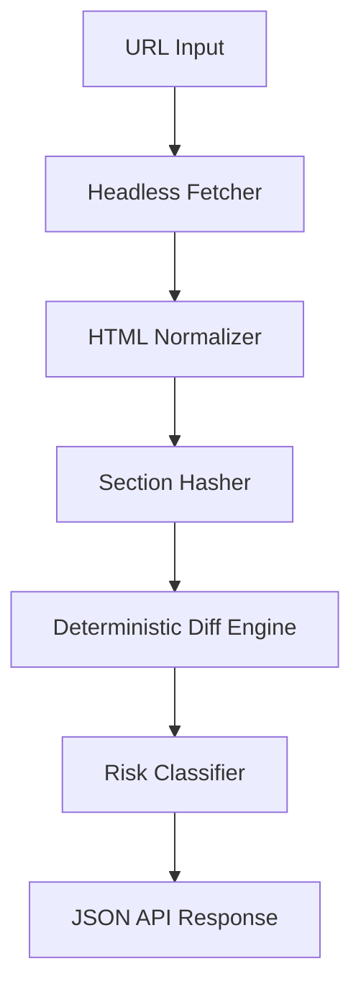

# PolicyDiff API

[](https://nodejs.org/)
[](LICENSE)

**Detect when companies silently change their privacy policies, terms, or pricing pages.**

PolicyDiff is a deterministic compliance engine that identifies meaningful structural and semantic changes in legal documents. It ignores formatting noise and focuses on shifts in legal intent, such as data sharing permissions and liability updates.

---

## Use It in 10 Seconds

The fastest way to analyze a policy for high-risk changes:

```bash
curl -X POST https://api.policydiff.com/v1/check \
  -H "Authorization: Bearer demo_key" \
  -d '{ "url": "https://stripe.com/privacy" }'
```

---

## Who This Is For

PolicyDiff is built for teams that need to monitor the external legal landscape at scale:

*   **Security Engineers**: Track vendor data-handling changes that impact your security posture.
*   **Compliance Engineers**: Ensure third-party processors remain compliant with GDPR, CCPA, and internal standards.
*   **Vendor Risk Teams**: Automate the tedious review process for hundreds of vendor TOS and Privacy updates.
*   **SaaS Platform Developers**: Build native "Policy Monitoring" features into your own applications.
*   **Legal Tech Platforms**: Power your automated legal audit and document review workflows.

---

## Why This Exists

SaaS vendors frequently update legal terms and pricing without clear notification. For compliance teams, manually monitoring hundreds of vendors is unscalable and prone to missing critical updates.

Traditional diff tools fail because they are "noise-sensitive"—a simple change in a website's footer or a date update triggers a false positive. PolicyDiff is "intent-sensitive," designed to find the 1% of changes that actually matter to your legal and security posture.

---

## Why Not Just Use Git Diff?

Standard diff tools like `git diff` or `wdiff` are built for code and plain text. They fail on policy pages for several reasons:

*   **HTML Layout Noise**: A CMS update that moves the sidebar triggers a "change" even if the legal text is identical.
*   **Tables & Nested Lists**: HTML tables are notoriously difficult to diff; PolicyDiff canonicalizes them into stable Markdown.
*   **Dynamic Components**: Scripts, ads, and navigation links change constantly, polluting standard diffs.
*   **Semantic Meaning Shifts**: `git diff` can't tell the difference between a typo fix and a critical liability removal.

### Standard Diff (Noisy)
```diff
- <div class="footer-v2">
-   <span>Last Updated: Jan 2024</span>
+ <div class="footer-v3">
+   <span>Last Updated: March 2024</span>
```

### PolicyDiff (Semantic)
```text
Data Sharing Section
- We do not share personal data with partners.
+ We may share personal data with partners.

Risk Level: HIGH
Reason: Negation removal detected near high-risk clause.
```

---

## Key Differentiators

What makes PolicyDiff different from a standard `git diff` or LLM-based analysis:

*   **Negation Detection**: Specifically flags shifts from "do not share" to "may share."
*   **Deterministic Logic**: No probabilistic AI. Results are 100% reproducible and auditable.
*   **Structural Normalization**: Automatically converts messy HTML tables and nested lists into stable Markdown formats.
*   **Temporal Masking**: Intelligently ignores "Last Updated" dates and version numbers that cause false alerts.

---

## Architecture Diagram



---

## Key Features

*   **Deterministic Change Detection**: Identical inputs always yield identical results.
*   **Section-Level Hashing**: Uses SHA-256 to track exactly which policy clauses were modified.
*   **Semantic Intent Detection**: Proximity clustering identifies high-risk verb-noun pairs.
*   **Isolation Drift Protection**: Detects if a website's layout changes significantly to prevent extraction errors.
*   **API-First Design**: Built for easy integration into existing security and compliance workflows.

---

## Quick Demo

### Example 1: Privacy Policy Change
**Input:** `https://stripe.com/privacy`

```json
{
  "risk_level": "HIGH",
  "changes": [
    {
      "section": "Data Sharing",
      "type": "MODIFIED",
      "risk": "HIGH",
      "reason": "Negation removed near high-risk clause",
      "details": [
        { "value": "We do not ", "removed": true, "added": false },
        { "value": "We may ", "removed": false, "added": true },
        { "value": "share data with third parties.", "removed": false, "added": false }
      ]
    }
  ]
}
```

### Example 2: Pricing & Terms Change
**Input:** `https://aws.amazon.com/service-terms`

```json
{
  "risk_level": "MEDIUM",
  "changes": [
    {
      "section": "Payment Terms",
      "type": "MODIFIED",
      "risk": "MEDIUM",
      "reason": "Numerical value change detected in liability section",
      "details": [
        { "value": "$500", "removed": true, "added": false },
        { "value": "$1,000", "removed": false, "added": true }
      ]
    }
  ]
}
```

---

## CLI (Coming Soon)

PolicyDiff is designed to fit into your CI/CD pipelines and local terminal workflows.

```bash
# Audit a policy directly from your terminal
npx policydiff https://stripe.com/privacy
```

The CLI will support local HTML file auditing, remote URL monitoring, and automated risk scoring for your local development environment.

---

## Installation

```bash
# Clone the repository
git clone https://github.com/mobin04/policy-diff-api.git
cd policy-diff-api

# Install dependencies
npm install
```

---

## Quick Start

### 1. Configure Environment
```bash
cp .env.config.example .env.config
# Update DATABASE_URL and API_SECRET
```

### 2. Initialize & Start
```bash
npm run migrate
npm run dev
```

### 3. Run a Check
```bash
curl -X POST http://localhost:3000/v1/check \
  -H "Authorization: Bearer YOUR_KEY" \
  -d '{ "url": "https://example.com/privacy" }'
```

---

## API Reference Overview

| Endpoint | Method | Description |
| :--- | :--- | :--- |
| `/v1/check` | `POST` | Synchronous analysis (fast fetch pages only). |
| `/v1/monitor` | `POST` | Asynchronous monitoring job (returns `job_id`). |
| `/v1/monitor/batch` | `POST` | Submit multiple URLs for batch processing. |
| `/v1/jobs/:id` | `GET` | Retrieve specific diff results and risk scores. |
| `/v1/usage` | `GET` | View current API key quota and tier limits. |

---

## Performance Characteristics

*   **O(1) Section Comparisons**: SHA-256 hashing allows for near-instant comparison of thousands of policy sections.
*   **High Throughput**: Capable of monitoring and analyzing thousands of pages per hour per node.
*   **Deterministic Integrity**: Guarantees identical diff outputs across different runs and server environments.
*   **Memory Efficiency**: Processes large legal documents with minimal memory footprint via stream-based normalization.

---

## How It Works

PolicyDiff processes every URL through a strict deterministic pipeline:

1.  **Fetch**: Retrieves HTML with browser-mimicking headers.
2.  **Normalize**: Converts tables and lists to stable Markdown; strips navigation/footers.
3.  **Sectionize**: Breaks content into logical sections based on header hierarchy.
4.  **Hash**: Generates SHA-256 hashes for each section content.
5.  **Diff**: Compares new hashes against the last stored snapshot.
6.  **Classify**: Runs the Risk Engine to determine if changes have legal significance.

---

## Example Use Cases

*   **Vendor Risk Management (VRM)**: Automate the monitoring of third-party vendor TOS.
*   **Regulatory Compliance**: Ensure your public policies match internal compliance requirements.
*   **SaaS Pricing Alerts**: Get notified immediately when competitors or vendors change pricing structures.
*   **Legal Tech Integrations**: Build policy monitoring features into your own GRC platform.

---

## Architecture Overview

PolicyDiff is built on a **Deterministic-First** philosophy. LLM-based diffing is often slow, expensive, and non-deterministic. PolicyDiff provides:

*   **Auditability**: Every change is backed by a specific rule (e.g., proximity clustering).
*   **Efficiency**: O(1) hash comparisons allow for monitoring thousands of pages per hour.
*   **Reliability**: Zero hallucination risk. If the content hasn't changed, the hash won't change.

---

## Roadmap

*   [ ] **Webhook Alerts**: Native POST notifications for "HIGH" risk changes.
*   [ ] **Official SDKs**: Dedicated clients for Node.js and Python.
*   [ ] **Delta Visualization**: A lightweight UI to visualize the "intent-diff" side-by-side.
*   [ ] **CLI Tool**: Audit local HTML files or remote URLs from your terminal.

---

## Contributing

We love contributions! See [CONTRIBUTING.md](CONTRIBUTING.md) for our standards and PR process.

---

## License

This project is licensed under the Apache License 2.0 - see the [LICENSE](LICENSE) file for details.
